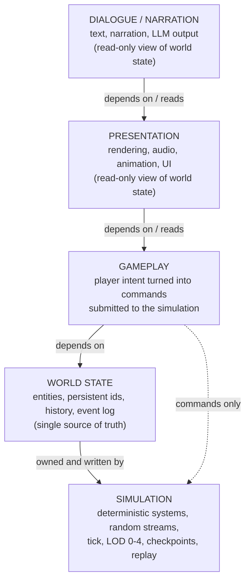
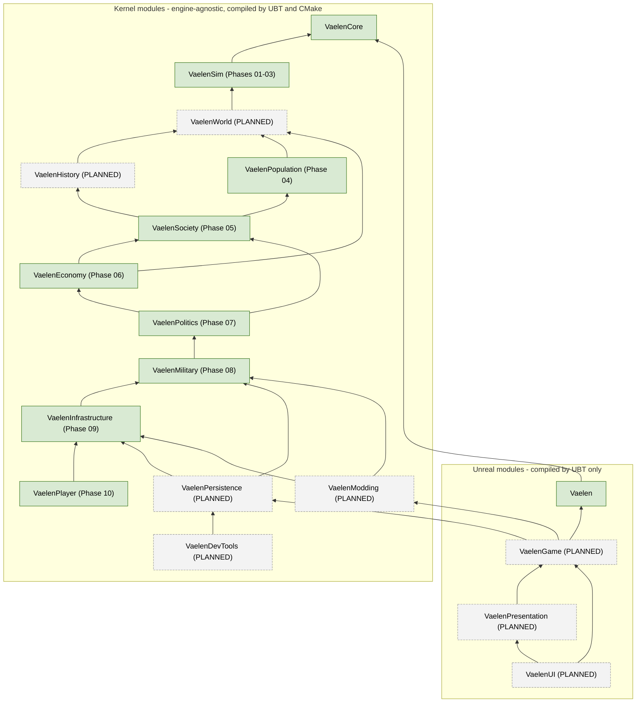

# VAELEN Architecture Reference

STATUS: VALIDATED for the code that exists (Phase 00 - FOUNDATION); everything marked
PLANNED describes later phases and does not exist in the repository yet.

This document is the reference for how the project is layered, built and organised.
Statements about the current code were checked against the sources listed in
[Sources checked](#12-sources-checked). Nothing here is a promise about performance
or gameplay; it describes structure and rules.

World: AELVOR. Project: VAELEN. Slogan: "NOTHING IS GIVEN. EVERYTHING IS INHERITED."
Secondary: "HISTORY BELONGS TO NO ONE."

Contents

1. [Layers and dependency direction](#1-layers-and-dependency-direction)
2. [Dual build: Unreal Build Tool and headless CMake](#2-dual-build-unreal-build-tool-and-headless-cmake)
3. [Module map](#3-module-map)
4. [Directory layout](#4-directory-layout)
5. [Foundation primitives that exist today](#5-foundation-primitives-that-exist-today)
6. [Test infrastructure](#6-test-infrastructure)
7. [Build pipeline](#7-build-pipeline)
8. [The first engine build](#8-the-first-engine-build)
9. [Determinism conventions embodied in the foundation](#9-determinism-conventions-embodied-in-the-foundation)
10. [Coding rules enforced by tooling](#10-coding-rules-enforced-by-tooling)
11. [Known discrepancies](#11-known-discrepancies)
12. [Sources checked](#12-sources-checked)

---

## 1. Layers and dependency direction

The project has five layers. The simulation is the single source of truth. Rendering,
dialogue and any LLM-driven narration are consumers of world state and never producers
of it.



Arrows point in the direction of allowed dependencies (a layer may include headers of
the layers below it). Data flows the other way: the simulation writes world state, the
layers above read it. The only way an upper layer influences the world is by submitting
a command to the simulation, which decides deterministically what happens.

Rules:

1. Dependencies point downward only. A lower layer never includes, calls or knows about
   a higher layer.
2. Kernel modules never include Unreal. Unreal modules may depend on kernel modules.
   Presentation never writes world state.
3. Neither rendering, dialogue nor any LLM may modify world state. Their output is
   derived from world state and is discarded without consequence.
4. Logging and assertions are diagnostics, not simulation state: they must never
   influence determinism (`Log.h` header comment; the log sink table is outside the
   world state).
5. Randomness in simulation code comes only from `Vaelen::RandomStream` hierarchies
   derived from the world seed; `rand()`, `<random>`, wall-clock time are banned
   (enforced by `Tools/check_kernel_purity.py`, rules R1 and R4).

What exists today per layer:

| Layer | Exists today | Where |
|---|---|---|
| SIMULATION | Foundation only: types, ids, random streams, hashing, logging, assertions, versions | `Source/VaelenCore` |
| WORLD STATE | Identity primitives only (`PersistentId`, `IdAllocator`, `RandomStreamState`) | `Source/VaelenCore` |
| GAMEPLAY | Nothing (PLANNED, Phases 10-12) | - |
| PRESENTATION | Engine bridge (log and assertion routing into Unreal) and a first read-only view: `AVaelenAtlasActor` generates a world in the editor and lays it out as relief with its towns, seats and roads. It only reads; it never writes world state. | `Source/Vaelen` |
| DIALOGUE / NARRATION | Nothing (PLANNED; no module assigned yet) | - |

## 2. Dual build: Unreal Build Tool and headless CMake

The same kernel sources are compiled twice, by two independent build systems:

- Unreal Build Tool (UBT) compiles `Source/<Module>` inside the UE 5.6 project
  (`Vaelen.uproject`, `Source/Vaelen.Target.cs`, `Source/VaelenEditor.Target.cs`,
  `Source/<Module>/<Module>.Build.cs`).
- CMake (`/CMakeLists.txt`, `Source/<Module>/CMakeLists.txt`) compiles the same files
  headless, without the engine, for unit / determinism / long-duration tests, CI and
  stress tests.

`<Module>Module.cpp` is the only Unreal-facing file of a kernel module. It contains the
`IMPLEMENT_MODULE` registration and includes `Modules/ModuleManager.h`. It is listed
nowhere in CMake (`Source/VaelenCore/CMakeLists.txt` enumerates every other source
explicitly) and it is skipped by the purity checker, which also rejects a second such
file per module (rule R0).

| Aspect | UBT (engine) | CMake (headless) |
|---|---|---|
| Source set | All of `Public/` and `Private/` including `VaelenCoreModule.cpp` | Same files minus `VaelenCoreModule.cpp` |
| `VAELEN_CORE_API` | Owned by the kernel (`CoreTypes.h`): `dllexport`/visibility when `VAELEN_CORE_EXPORTS` (private definition of the module in modular builds), `dllimport`/visibility when `VAELEN_CORE_IMPORTS` (public definition seen by dependants), empty in monolithic builds. UBT's own `VAELENCORE_API=DLLEXPORT` token is never used: `DLLEXPORT` only exists after `HAL/Platform.h`, which the kernel never includes | Empty (no `VAELEN_CORE_EXPORTS`/`IMPORTS` defined) |
| Build define | `VAELEN_UNREAL_BUILD=1` (`VaelenCore.Build.cs`, `PublicDefinitions`) | `VAELEN_HEADLESS_BUILD=1` |
| Assertions | `VAELEN_ASSERTS_ENABLED` defined by `VaelenCore.Build.cs` from the target configuration: 1 in Debug, DebugGame and Development, 0 in Test and Shipping (mirrors `DO_CHECK`; UBT defines `NDEBUG` in every non-debug-CRT configuration, so the NDEBUG convention is not used). `Assert.h` falls back to `UE_BUILD_SHIPPING`/`UE_BUILD_TEST` if undefined | `VAELEN_ASSERTS_ENABLED=1` or `=0` from option `VAELEN_ENABLE_ASSERTS` (default ON; the `*-noasserts` presets set it OFF) |
| Log compile floor | `VAELEN_LOG_COMPILED_MIN_LEVEL` defined by `VaelenCore.Build.cs`: 2 (Info) in Shipping, else 0 (Trace) | Trace (no override; `Test_LogFloor.cpp` overrides it per translation unit) |
| Floating point | In-source pragmas in `Random.cpp` (`clang fp contract(off)`, `GCC optimize("fp-contract=off")`, MSVC `fp_contract(off)`), ADR-0009 | Same pragmas plus `-ffp-contract=off` / `/fp:precise` (`/clang:-ffp-contract=off` for clang-cl) |
| Exceptions / RTTI | `bEnableExceptions = false`, `bUseRTTI = false` | `-fno-exceptions -fno-rtti`; MSVC: `/GR-`, `_HAS_EXCEPTIONS=0`, `/EHs-c- /wd4577` |
| PCH / unity | `PCHUsage = NoPCHs`, `bUseUnity = false` | n/a |
| Language | `CppStandardVersion.Cpp20` | `CMAKE_CXX_STANDARD 20`, extensions OFF |
| Warnings | UBT defaults. The modular editor build is clean of errors and raises 654 C4251 (STL member of a dllexported class) and 42 C4996 (engine deprecations reached through `Vaelen.cpp`); neither is silenced, see section 8.3 | `-Wall -Wextra -Wpedantic -Wshadow -Wconversion -Wsign-conversion -Wold-style-cast -Wcast-align -Wnon-virtual-dtor -Woverloaded-virtual -Wnull-dereference -Wdouble-promotion -Wformat=2`, `-Werror` when `VAELEN_WARNINGS_AS_ERRORS` (default ON); MSVC `/W4 /permissive- /utf-8 /WX` (the assertion and harness macros are written so constant conditions do not trigger C4127) |
| Engine dependency | `VaelenCore` -> `Core` only (needed by `VaelenCoreModule.cpp`) | None |
| Output | Runtime module, loading phase `PreDefault` | Static library `VaelenCore` (alias `Vaelen::Core`) and test executable `VaelenCoreTests` |
| Status | VALIDATED (2026-09-07): UE 5.6.1, MSVC 14.51 (Visual Studio 2026), `VaelenEditor` Win64 Development built clean and opened; see section 8 | VALIDATED: clang 18 and gcc 13 (Linux), six presets, 133 tests, 0 warnings |

Where the defines are consumed today: `VAELEN_UNREAL_BUILD` in `Assert.h` and `Log.h`
(fallbacks only); `VAELEN_CORE_API` on every exported symbol (never on `constexpr`/inline
functions); `VAELEN_ASSERTS_ENABLED` in `Assert.h` and the tests. `VAELEN_HEADLESS_BUILD`
is defined by CMake for future headless-only entry points and is not read by any source
yet. Later kernel modules follow the same pattern with their own `VAELEN_<MODULE>_API`,
`VAELEN_<MODULE>_EXPORTS` and `VAELEN_<MODULE>_IMPORTS`.

## 3. Module map

### 3.1 Existing modules

| Module | Kind | Layer | Depends on | Status |
|---|---|---|---|---|
| `VaelenCore` | Kernel (UBT Runtime module, `PreDefault`; CMake static library) | Foundation of SIMULATION and WORLD STATE | UBT: `Core` (module registration only). CMake: none. | VALIDATED headless; VALIDATED under UBT (UE 5.6, 2026-09-07, editor) |
| `VaelenSim` | Kernel (UBT Runtime module, `PreDefault`; CMake static library), Phase 01 | SIMULATION (entities, components, systems, clock, events) | UBT: `Core`, `VaelenCore`. CMake: `Vaelen::Core`. | Phases 01-03 VALIDATED headless; VALIDATED under UBT (UE 5.6, 2026-09-07, editor) |
| `VaelenPopulation` | Kernel (UBT Runtime module, `PreDefault`; CMake static library), Phase 04 | SIMULATION (persons, families, demographics) | UBT: `Core`, `VaelenCore`, `VaelenSim`. CMake: `Vaelen::Sim`, `Vaelen::Core`. | VALIDATED headless (04.01-04.08, Phase 04 closed); VALIDATED under UBT (UE 5.6, 2026-09-07, editor) |
| `VaelenSociety` | Kernel (UBT Runtime module, `PreDefault`; CMake static library), Phase 05 | SIMULATION (organisations, standing, norms, bondage) | UBT: `Core`, `VaelenCore`, `VaelenSim`, `VaelenPopulation`. CMake: `Vaelen::Population`, `Vaelen::Sim`, `Vaelen::Core`. | VALIDATED headless (05.01-05.08, Phase 05 closed); VALIDATED under UBT (UE 5.6, 2026-09-07, editor) |
| `VaelenEconomy` | Kernel (UBT Runtime module, `PreDefault`; CMake static library), Phase 06 | SIMULATION (goods, stocks, production, markets, trade, wealth) | UBT: `Core`, `VaelenCore`, `VaelenSim`, `VaelenPopulation`, `VaelenSociety`. CMake: `Vaelen::Society`, `Vaelen::Population`, `Vaelen::Sim`, `Vaelen::Core`. | 06.01-06.08 VALIDATED headless; VALIDATED under UBT (UE 5.6, 2026-09-07, editor) |
| `VaelenPolitics` | Kernel (UBT Runtime module, `PreDefault`; CMake static library), Phase 07 | SIMULATION (polities, law, authority, succession, diplomacy) | UBT: `Core`, `VaelenCore`, `VaelenSim`, `VaelenPopulation`, `VaelenSociety`, `VaelenEconomy`. CMake: `Vaelen::Economy`, `Vaelen::Society`, `Vaelen::Population`, `Vaelen::Sim`, `Vaelen::Core`. | 07.01-07.08 VALIDATED headless, Phase 07 closed; UNVERIFIED under UBT (newer than the first Unreal build) |
| `VaelenMilitary` | Kernel (UBT Runtime module, `PreDefault`; CMake static library), Phase 08 | SIMULATION (levies, armies, battle, siege, war) | UBT: `Core`, `VaelenCore`, `VaelenSim`, `VaelenPopulation`, `VaelenSociety`, `VaelenEconomy`, `VaelenPolitics`. CMake: `Vaelen::Politics` and below. | 08.01-08.08 VALIDATED headless, Phase 08 closed; UNVERIFIED under UBT |
| `VaelenInfrastructure` | Kernel (UBT Runtime module, `PreDefault`; CMake static library), Phase 09 | SIMULATION (buildings, settlements, roads, decay, logistics) | UBT: `Core`, `VaelenCore`, `VaelenSim`, `VaelenPopulation`, `VaelenSociety`, `VaelenEconomy`, `VaelenPolitics`, `VaelenMilitary`. CMake: `Vaelen::Military` and below. | 09.01-09.08 VALIDATED headless, Phase 09 closed; UNVERIFIED under UBT |
| `VaelenPlayer` | Kernel (UBT Runtime module, `PreDefault`; CMake static library), Phase 10 | SIMULATION (the player as one simulated person, and their intent as commands) | UBT: `Core`, `VaelenCore`, `VaelenSim`, `VaelenPopulation`, `VaelenSociety`, `VaelenEconomy`, `VaelenPolitics`, `VaelenMilitary`, `VaelenInfrastructure`. CMake: `Vaelen::Infrastructure` and below. | 10.01-10.07 PROTOTYPE headless; UNVERIFIED under UBT |
| `VaelenPolitics` | Kernel (UBT Runtime module, `PreDefault`; CMake static library), Phase 07 | SIMULATION (polities, law, authority, succession, diplomacy) | UBT: `Core`, `VaelenCore`, `VaelenSim`, `VaelenPopulation`, `VaelenSociety`, `VaelenEconomy`. CMake: `Vaelen::Economy`, `Vaelen::Society`, `Vaelen::Population`, `Vaelen::Sim`, `Vaelen::Core`. | 07.01 VALIDATED headless; UNVERIFIED under UBT (newer than the first Unreal build) |
| `Vaelen` | Unreal primary game module (`IMPLEMENT_PRIMARY_GAME_MODULE`, Runtime, `Default`) | Engine bridge (PRESENTATION side) | `Core`, `CoreUObject`, `Engine`, `InputCore`, `VaelenCore` | VALIDATED (UE 5.6, 2026-09-07): built and started in the editor |

`Vaelen` installs a kernel log sink (`FVaelenLogSink`, routes `Vaelen::LogRecord` to
`UE_LOG(LogVaelen, ...)`) and a kernel assertion handler (`ensureAlwaysMsgf` for Ensure,
`UE_LOG(..., Fatal, ...)` for Check) in `StartupModule`, and removes both in
`ShutdownModule`. Both targets (`Vaelen`, `VaelenEditor`) list `VaelenCore` and `Vaelen`
in `ExtraModuleNames`.

### 3.2 Planned modules per phase (PLANNED unless marked as existing)

| Phase | Module | Kind | Notes |
|---|---|---|---|
| 00 FOUNDATION | `VaelenCore` | Kernel | Exists (see above). |
| 01 CORE SIMULATION | `VaelenSim` | Kernel | Exists: entity handles and registry (01.01), component type registry, pools and store (01.02), systems, scheduler and LOD periods (01.03), clock and calendar (01.04), events, event log and bus (01.05), world, archives and versioned snapshot (01.06), deterministic replay gate (01.07), long-duration mini-world gate (01.08), tile grid, tile layers and world map state block (02.01), Q32.32 fixed point and deterministic lattice noise (02.02), elevation and coastline generation with terrain flags, slope and ASCII export (02.03), climate and biomes (02.04), hydrology with rivers and lakes as entities (02.05), regions with a derived adjacency graph (02.06), resource deposits (02.07), one-call pipeline and frozen whole-world digests (02.08). Phases 01 and 02 closed (headless); Phase 03 in progress: eras and the chronicle (03.01), cultures and coarse population per region with growth, migration and splits (03.02), languages with phonology drift and pronounceable unique names as components (03.03), religions born from events with believers per region, spread along the graph and with migration, schisms and tenets (03.04), disasters and omens tied to the world with deaths, faith and era consequences (03.05), the one-call pre-history run with a per-century frozen reference (03.06), why-queries, region timelines and the chronicle as text (03.07), the Phase 03 gate (03.08). Phases 01, 02 and 03 closed (headless). |
| 02 WORLD | `VaelenWorld` | Kernel | Regions, tiles, rivers, resource deposits (`IdKind` 10-13 already reserved). |
| 03 HISTORY | `VaelenHistory` | Kernel | Historical record, eras, cultures, languages, religions. |
| 04 POPULATION | `VaelenPopulation` | Kernel | Exists: the module, persons as entities and the two grains of population with promotion and demotion (04.01), the yearly life cycles of detailed regions with the coarse systems observing the RegionLod marker (04.02), families, marriages and lineage queries (04.03), needs and body - rations, famine from drought, disease from plague, deaths with the disaster event as cause (04.04), traits from identity and parents, skills through life and names in the person's language (04.05), the LOD bridge - requested regions promoted and demoted, persons crossing to and from the coarse grain (04.06), persons in the chronicle - the records that matter, one line per person event, stories and the why of a death (04.07); the Phase 04 gate runs all of it for 500 years over the 256 pre-history (04.08). Phase 05 (society) builds organisations, standing, norms and bondage on these persons.|
| 05 SOCIETY | `VaelenSociety` | Kernel | Exists: the module, organisations as entities - councils seated by the heads of the largest houses, temples by the most pious of the majority faith - with seats refilled yearly, heads seated, the empty disbanded, coarse seats keeping their count (05.01), standing - a yearly score from house, age, traits, skills and offices, ranks and tiers, the elite of a region (05.02), norms per culture from identity and parent, drifting on schisms and disasters, with the marriage customs observed by the family system (05.03), bondage and slavery as institutions - debt and birth entries, hardening, manumission and flight, holders among the elite, strata per region (05.04), organisations acting - grain against drought observed by the need system, preaching, training, raids planned for Phase 08, guilds and warbands from the skilled (05.05), the social shape across the grains - strata kept through a demotion and binding the new persons at a promotion (05.06), society in the chronicle - the records that matter, one line per society event, the why of a decision (05.07); the Phase 05 gate runs all of it with every Phase 04 system for 500 years over the 256 pre-history (05.08). Phase 06 (economy) builds goods, markets, trade and wealth on these houses and organisations.|
| 06 ECONOMY | `VaelenEconomy` | Kernel | Exists: the module, goods as kinds, stocks held in common by every region and by the houses of a detailed region, endowed once from the land, split at a promotion, folded at a demotion, returned by an extinct house, conserved across the grains, moved by hand with a cause (06.01); the yearly harvest from the land, the people and their farming, cut by droughts, spoiled in store, eaten by house, the ration written for the need system, the deposits and the craft (06.02); a market on every region with integer prices from what it wants over what it holds within a floor and a ceiling, price events with the harvest as cause (06.03); routes between neighbouring markets opened on price gaps and closed when idle, goods carried yearly from the cheap side to the dear one, settlements founded by the traffic and abandoned without it (06.04); houses valued and ranked at their market with the rank weighing in standing, heirs named by the descent custom and an extinct house's goods passing to its heir (06.05); nothing of the fine grain outliving it, proved by five hundred years of alternating detail that keep every unit of every good (06.06); roads, towns, prices at their bounds, shortfalls, fortunes and inheritances in the chronicle, with a line for every economic event and the why of a dear loaf reaching the drought (06.07); the whole of it held for five hundred years at 256 beside every Phase 04 and 05 system (06.08, Phase 06 closed). |
| 07 POLITICS | `VaelenPolitics` | Kernel | Exists: the module, polities as entities founded on the councils of Phase 05, seated in a region, ruled by that council's head, holding regions that remember whose they are through every change of detail, dissolved when they rule nothing (07.01); law as one number on the polity, written onto every region it rules as dues the economy's production system observes, collected in grain into a treasury, moving by itself with what the treasury holds (07.02); authority written on every ruled region and falling with its distance from the seat, the upkeep a word costs, ground taken while the treasury pays and ground that slips free when it does not (07.03); the line a polity remembers, the claimant its culture's descent custom names, and the unrest a seat taken by anyone else takes off every hold (07.04); factions as entities of their own kind, formed around a passed-over claimant or a province held too loosely, gathering while unanswered and taking their region out of the polity at their threshold (07.05); relations between polities whose ground touches, warmed and cooled by culture, trade, border and size, with a war marking the weaker border in play for the reach system to take (07.06); a sentence for every political event and a record only for what a century would remember (07.07); the phase gate, five centuries of two powers at 256 with every Phase 04 to 07 system (07.08). Phase closed. |
| 08 MILITARY | `VaelenMilitary` | Kernel | Exists: the module, levies raised from the regions a polity holds and fed out of its treasury, armies as entities that melt when they are not fed (08.01), marching on the region graph towards the nearest enemy ground, eating off what it stands on and loosening an enemy ruler's grip (08.02). battle between two hosts on one region, decided by strength, whose ground it is and a stream fixed by the world seed (08.03). siege, the only way a capital changes hands and a polity ends (08.04). war as a thing with a beginning and an end, opened by a relation turning and closed by exhaustion, with the stance of 07.06 following it (08.05). what war costs the living - the dead where they came from, the standing of those who came back, the people who would not stay (08.06). war in the chronicle, a sentence for every military event and the why of a lost province (08.07), and the phase gate: five centuries at 256 with every Phase 04 to 08 system (08.08). Phase closed. |
| 09 INFRASTRUCTURE | `VaelenInfrastructure` | Kernel | Exists: the module, buildings as entities of kind Building raised out of a region's common stock and the hands it can spare, one work of each kind per region made bigger as the region grows, what each has cost recorded and taken in the log (09.01); and what each kind does, as the one number an earlier phase already reads - a granary softening the drought of 04.04, a mill and a smithy lifting the harvest and the craft of 06.02, a wall slowing what a siege of 08.04 brings down (09.02); and settlements given a body - one tile of their region chosen once, a size from the people around and the goods through, and the works of the region standing in the town where there is one (09.03); and roads - a route of 06.04 cut out of the two ends together where enough already crosses, letting more of the trade that already wanted to happen get across, worn when nobody keeps it and fallen back to a track (09.04); and decay - every work wearing at the rate of what it is, faster where a flood or a host struck, mended out of the common stock or lost, and the ruin it leaves making the next one cheaper (09.05); and logistics - one number on the ground written from the best road touching it, read by the marching of 08.02 (further in a year, less eaten off the field) and by the reach of 07.03 (the hold falling away more slowly, the word costing less to carry) (09.06); and infrastructure in the chronicle - a granary raised, a mill fallen in, a road cut, a town settled, with the fall naming the flood that finished it and the text falling through to the military layer and every layer under it (09.07), and the phase gate: five centuries at 256 with every Phase 04 to 09 system (09.08). Phase closed. |
| 10 PLAYER | `VaelenPlayer` | Kernel | Exists: the module, and the player as a mark on an existing person of a detailed region - one to a world, doing nothing at all, with a world that carries one running exactly as a world that does not (10.01); the enslaved start, found among the people 05.04 had already bound rather than written into the world, with the ore ground a preference the record is honest about (10.02); and the player's grain - the first system in nine phases to run at the day rather than the year, granting waking hours to one person and publishing nothing, so that a world with somebody living an hour at a time writes the same history as one without (10.03); and intent as commands - a queue the outside submits to, which moves nothing at all, and PlayerOrderSystem inside the simulation as the only thing allowed to act on one, so that a stream of 1200 recorded intents replayed blind into a fresh world of the same seed gives the same verdicts, the same queue and the same event log (10.04); and the seven verbs, none of which writes anything itself - work and giving through Economy::AddStock, eating and resting through the needs of 04.04, walking through Population::MovePerson (new in 04.06, which reconciles the coarse counts of both regions so the two grains still agree), speaking through nothing but the act in the log that 10.06 reads (10.05); and what the people around the player make of them, read out of those acts and nothing else, with the standing of 05.02 entering in one place only - an opinion is worth what its holder is worth, so the repute of the player is the opinions weighted by rank, read from 05.02 and never written to it (10.06); and the player in the chronicle - a life as records of what touched somebody, every event with a sentence in the same hand as every layer below, and the why of anything that happened because of them walked back through those layers to its root (10.07). |
| 10 PLAYER, 11 MINING COLONY, 12 GAMEPLAY | `VaelenGame` | Unreal | Player, input, gameplay commands; the mining colony start is content in the domain modules plus `VaelenGame`, not a separate module. |
| 13 PRESENTATION | `VaelenPresentation` | Unreal | Rendering / audio / animation of world state, read-only. |
| 14 UI | `VaelenUI` | Unreal | UI, read-only view plus command submission through `VaelenGame`. |
| 15 STREAMING & LOD | no dedicated module listed | - | Simulation LOD belongs to `VaelenSim`; engine streaming to `VaelenPresentation` / `VaelenGame`. To be decided in Phase 15. |
| 16 SAVE / PERSISTENCE | `VaelenPersistence` | Kernel | Save format, versioning (`VAELEN_SAVE_FORMAT_VERSION`), migration. |
| 17 DEBUG TOOLS | `VaelenDevTools` | Kernel (headless inspectors, replay tooling); an editor-side part may follow | - |
| 18 STRESS TEST | no module | - | Tests and tools only. |
| 19 MODDING | `VaelenModding` | Kernel | Data-driven definitions loaded into the domain modules. |
| 20 POLISH | no module | - | - |

The DIALOGUE / NARRATION layer has no module assigned yet (PLANNED).

### 3.3 Allowed dependency graph



Arrows mean "depends on". Solid green nodes exist; dashed nodes are PLANNED and their
exact edges are fixed when the corresponding phase starts. The rules below are fixed now:

1. Kernel modules form a DAG with `VaelenCore` at the root. Every kernel module depends
   on `VaelenCore` directly or transitively; cycles are forbidden.
2. No kernel module depends on an Unreal module or includes an engine header. Quoted
   includes inside a kernel module must start with `Vaelen/` (purity rule R1), so a
   kernel module can only see other kernel modules' `Public/` trees.
3. Unreal modules may depend on any kernel module and on each other, downward only:
   `VaelenUI` -> `VaelenPresentation` -> `VaelenGame` -> `Vaelen` -> kernel.
4. `VaelenPresentation` and `VaelenUI` read world state; they never write it. Player
   intent reaches the simulation only as commands through `VaelenGame` (interface
   PLANNED in Phase 01/10).
5. Leaf kernel modules (`VaelenPersistence`, `VaelenDevTools`, `VaelenModding`) may
   depend on every domain module; no domain module depends on them.
6. Each new kernel module must be: added to `Tools/kernel_modules.txt`, added with
   `add_subdirectory` in `/CMakeLists.txt`, given a `<Module>.Build.cs`, a
   `CMakeLists.txt` listing its sources explicitly, a `Public/Vaelen/<Name>/` header
   tree, at most one `<Module>Module.cpp`, and listed in `Vaelen.uproject` and the
   targets' `ExtraModuleNames`. `Tools/check_kernel_purity.py` fails (exit 2) when a
   listed module directory is missing.

`IdKind` in `Ids.h` already reserves value ranges per future module: 1-2 core, 10-13
world, 20-25 history and society, 30-34 economy and infrastructure, 40-43 politics and
military, 50-51 knowledge (Phase 12). Values are part of the save format: append only.

## 4. Directory layout

```
/
  Vaelen.uproject                 UE 5.6 project; modules VaelenCore (PreDefault), Vaelen (Default)
  CMakeLists.txt                  headless kernel build (root); options, warning flags, defines
  CMakePresets.json               configure/build/test presets used by CI (see section 7)
  .clang-format                   Allman braces, tabs, 120 columns, PascalCase style base
  .editorconfig                   tabs for C++/C#, 2 spaces for md/yml/json/cmake/py
  .github/workflows/kernel-ci.yml headless CI matrix
  Config/                         Default*.ini (engine, game, editor, input) - read by the editor 2026-09-07
  Content/                        empty (Unreal content, none yet)
  Docs/                           ARCHITECTURE.md (this document), CONVENTIONS.md (coding and process
                                  rules), DECISIONS.md (ADRs), ROADMAP.md (phases and tasks), STATUS.md
                                  (living build status)
  Source/
    Vaelen.Target.cs              Game target
    VaelenEditor.Target.cs        Editor target
    VaelenCore/                   KERNEL MODULE
      VaelenCore.Build.cs         UBT rules (no PCH, no unity, no exceptions, no RTTI, C++20)
      CMakeLists.txt              explicit source list (VaelenCoreModule.cpp excluded)
    VaelenSim/                    KERNEL MODULE (Phase 01): Public/Vaelen/Sim/*.h, Private/*.cpp, VaelenSim.Build.cs, CMakeLists.txt
    VaelenPopulation/             KERNEL MODULE (Phase 04): Public/Vaelen/Population/*.h, Private/*.cpp, VaelenPopulation.Build.cs, CMakeLists.txt
    VaelenSociety/                KERNEL MODULE (Phase 05): Public/Vaelen/Society/*.h, Private/*.cpp, VaelenSociety.Build.cs, CMakeLists.txt
    VaelenEconomy/                KERNEL MODULE (Phase 06): Public/Vaelen/Economy/*.h, Private/*.cpp, VaelenEconomy.Build.cs, CMakeLists.txt
    VaelenPolitics/               KERNEL MODULE (Phase 07): Public/Vaelen/Politics/*.h, Private/*.cpp, VaelenPolitics.Build.cs, CMakeLists.txt
    VaelenMilitary/               KERNEL MODULE (Phase 08): Public/Vaelen/Military/*.h, Private/*.cpp, VaelenMilitary.Build.cs, CMakeLists.txt
    VaelenInfrastructure/         KERNEL MODULE (Phase 09): Public/Vaelen/Infrastructure/*.h, Private/*.cpp, VaelenInfrastructure.Build.cs, CMakeLists.txt
    VaelenPlayer/                 KERNEL MODULE (Phase 10): Public/Vaelen/Player/*.h, Private/*.cpp, VaelenPlayer.Build.cs, CMakeLists.txt
      Public/Vaelen/Core/         CoreTypes.h Version.h Assert.h Log.h Hash.h Random.h Ids.h
      Private/                    Assert.cpp Log.cpp Random.cpp Ids.cpp Version.cpp
                                  VaelenCoreModule.cpp (Unreal-facing, UBT only)
    Vaelen/                       UNREAL PRIMARY GAME MODULE (UBT only)
      Vaelen.Build.cs
      Public/Vaelen.h             FVaelenModule, LogVaelen category
      Private/Vaelen.cpp          sink + assert handler installation, IMPLEMENT_PRIMARY_GAME_MODULE
      Private/VaelenLogSink.h/.cpp  Vaelen::ILogSink -> UE_LOG
  Tests/
    CMakeLists.txt                add_subdirectory(Core); registers Kernel.Purity
    Harness/VaelenTest.h          test macros, registry, ScopedAssertCapture
    Harness/TestMain.cpp          runner: --suite --filter --list --verbose --quiet-log
    Core/CMakeLists.txt           VaelenCoreTests; one CTest "Core.<Suite>" per Test_<Suite>.cpp
    Core/Test_*.cpp               Assert CoreTypes Harness Hash Ids Log LogFloor Random Version
    Sim/CMakeLists.txt            VaelenSimTests; one CTest "Sim.<Suite>" per Test_<Suite>.cpp
    Sim/Test_*.cpp                EntityHandle EntityRegistry ComponentType ComponentPool ComponentStore SimClock Scheduler Event EventLog EventBus
  Tools/
    check_kernel_purity.py        purity checker (rules R0-R7, --self-test)
    kernel_modules.txt            list of kernel modules to check (VaelenCore)
  out/                            build trees (git-ignored)
```

Include convention: kernel headers are included as `#include "Vaelen/Core/<Header>.h"`;
future modules use `Vaelen/<Name>/...`. Unreal-only headers (`Vaelen.h`,
`VaelenLogSink.h`) are included by their bare name inside the `Vaelen` module.

## 5. Foundation primitives that exist today

All files below carry `// STATUS: VALIDATED (Phase 00)` in their header, with the note
that integration and long-duration tests are deferred to Phase 01. Test counts are from
`VaelenCoreTests --list`: Assert 33, CoreTypes 1, Harness 5, Hash 15, Ids 19, Log 23, LogFloor 1, Random 29, Version 7 (133 tests with assertions, 108 without); all pass with clang 18 and gcc 13 in every preset
(21 914 checks with assertions enabled).

### CoreTypes (`CoreTypes.h`) - VALIDATED

Fixed-width aliases `int8..int64`, `uint8..uint64`, `usize` in namespace `Vaelen`; the
64-bit aliases are spelled `long long` so they are the same types as Unreal's `int64`/
`uint64` on Linux too. Static asserts on integer widths, IEEE-754 (`is_iec559`) and
little-endian byte order (state is persisted as raw bytes). Owns the export macro
`VAELEN_CORE_API` and `VAELEN_MSVC_WARNING_SUPPRESS`. `NonCopyable` base, `ArrayCount`,
`ToUnderlying`. No `.cpp`. Tested by `Test_CoreTypes.cpp` (compile-time contracts) and
indirectly by every suite.

### Version (`Version.h`, `Version.cpp`) - VALIDATED

Two independent version lines: project version `0.0.1` (`VAELEN_VERSION_MAJOR/MINOR/PATCH`,
`ProjectVersion{uint16 x3}`, `GetProjectVersion()`, `GetProjectVersionString()` with static
storage) and save-format version `VAELEN_SAVE_FORMAT_VERSION 1` (`GetSaveFormatVersion()`,
constexpr), bumped only when the persisted layout changes and never reused. 7 tests
(suite `Version`).

### Assert (`Assert.h`, `Assert.cpp`) - VALIDATED

`VAELEN_CHECK`, `VAELEN_CHECKF` (printf-style, 1024-byte buffer), `VAELEN_VERIFY`
(always evaluated), `VAELEN_ENSURE` (non-fatal, yields the bool, evaluated exactly once),
`VAELEN_UNREACHABLE`. A pluggable handler (`SetAssertHandler(Handler, UserData)`) receives
an `AssertInfo` (kind, expression, file, line, function, message); the default handler
logs to `LogCore` and aborts on Check. `GetAssertFailureCount()` counts every report.
With assertions disabled, CHECK is not evaluated, VERIFY is, ENSURE still yields its
value. 28 tests (suite `Assert`), including the compiled-out contracts.

### Log (`Log.h`, `Log.cpp`) - VALIDATED

Levels `Trace(0)..Fatal(5), Off(6)`; `LogCategory{Name, MinLevel}` (default `Info`;
`LogCore` is at `Trace`); `VAELEN_DECLARE/DEFINE_LOG_CATEGORY`; `VAELEN_LOG_TRACE..FATAL`
macros with a compile-time floor `VAELEN_LOG_COMPILED_MIN_LEVEL` and a runtime global
minimum. Sinks implement `ILogSink::Write(const LogRecord&)` / `Flush()`; the table holds
at most 8 non-owned sinks, guarded by a mutex, so sinks need not be thread-safe.
`StdioLogSink` prints `[Level] Category: message` (Warning and above to stderr).
`GetDispatchedRecordCount()` counts delivered records. Logging is not simulation state.
20 tests (suite `Log`), including an 8-thread dispatch test.

### Hash (`Hash.h`) - VALIDATED

Header-only, constexpr, platform-independent, non-cryptographic: FNV-1a 64
(`HashBytes`, `HashString`, `"name"_vhash`), SplitMix64 finaliser `Mix64` (bijective),
`HashCombine(A, B)` (order-dependent), `HashUInt64`. Used for named random-stream
derivation, content addressing and stable map keys. 15 tests (suite `Hash`), including
published FNV vectors and frozen `HashCombine` regression values.

### Random (`Random.h`, `Random.cpp`) - VALIDATED

`RandomStream`: xoshiro256** seeded through SplitMix64; state `RandomStreamState{Seed,
S[4], DrawCount}` is trivially serialisable and round-trips via `GetState/SetState`.
Hierarchy: `Derive(name)` / `Derive(Hash64)` and `Fork(index)` create children from the
parent's root seed plus a fixed domain salt (`"VAELEN-N"` / `"VAELEN-I"`), without
advancing the parent, so adding a draw in one system never perturbs another. Draws:
`NextU64/NextU32`, `Below` (bitmask-with-rejection, unbiased, no 128-bit multiply),
`RangeInclusive[U]`, `NextDouble` (53 bits), `NextFloat` (24 bits), `RangeDouble`,
`Chance`, `NextNormal` (Marsaglia polar, no cached second variate), `Jump` (2^128).
Sequences are bit-identical across platforms because the generator uses integers only.
23 tests (suite `Random`), including known answers against independent reference
implementations and fixed-seed distribution checks.

### Ids (`Ids.h`, `Ids.cpp`) - VALIDATED

`PersistentId`: 64-bit, layout `[8 bits IdKind][56 bits serial]`, serial starts at 1,
`Value == 0` is `Invalid()`, `MaxSerial = 2^56 - 1`; ordered, hashable (`std::hash`
specialisation via `Mix64`), never reused. `IdKind` enumerators are save-format values
(append only). `IdAllocator`: one monotonic counter per kind (`State` = 256 x `uint64`,
part of the world state, saved and loaded with it); `Allocate` (Check failure and
`Invalid()` on kind `None` or on exhaustion, counters never wrap), `PeekNext`,
`GetAllocatedCount`, `ReserveUpTo`, `Reset`, `SetState` (sanitises zero counters to 1).
Not thread-safe by design: allocation happens on the simulation thread in a
deterministic order. Runtime slot handles with generation counters are a separate
Phase 01 concept (PLANNED). 17 tests (suite `Ids`).

### Test harness (`Tests/Harness/VaelenTest.h`, `TestMain.cpp`) - VALIDATED

See section 6. 2 self-tests (suite `Harness`).

## 6. Test infrastructure

- Harness: `Tests/Harness/VaelenTest.h`. No external dependency, no exceptions, no RTTI.
  `VAELEN_TEST(Suite, Name)` registers a function in an intrusive linked list in
  declaration order. Checks: `VT_CHECK`, `VT_CHECK_MSG`, `VT_REQUIRE` (returns from the
  test), `VT_CHECK_EQ`, `VT_REQUIRE_EQ`, `VT_CHECK_NE`, `VT_CHECK_STREQ`, `VT_CHECK_NEAR`.
  `VaelenTest::ScopedAssertCapture` installs a kernel assertion handler that counts
  Check/Ensure reports instead of aborting and restores the default on destruction.
- Runner: `Tests/Harness/TestMain.cpp` builds `VaelenCoreTests`. Options: `--suite Name`,
  `--filter Substring`, `--list`, `--verbose` (also enables the stdout log sink),
  `--quiet-log` (default). Exit codes: 0 all passed, 1 failures, 2 usage, 3 no test
  matched. Summary line: `VAELEN <version> tests: N run, P passed, F failed, C checks`.
- CTest mapping: `Tests/Core/CMakeLists.txt` globs `Test_*.cpp` (`CONFIGURE_DEPENDS`) and
  registers one CTest `Core.<Suite>` per file running `VaelenCoreTests --suite <Suite>`.
  A suite name that does not match its file name yields "no test matched" (exit 3) and
  fails CTest. `Tests/CMakeLists.txt` registers `Kernel.Purity` when Python 3 is found
  (warning otherwise).
- Purity check: `Tools/check_kernel_purity.py --root <repo>` scans every module in
  `Tools/kernel_modules.txt` (`Public/**/*.h,*.inl`, `Private/**/*.cpp,*.h,*.inl`,
  skipping `*Module.cpp`). Rules: R0 structure, R1 include whitelist (quoted includes
  start with `Vaelen/`; angle includes are standard headers not in the ban list, which
  includes `<random>`, `<chrono>`, `<ctime>`, `<iostream>`, `<filesystem>`, `<exception>`,
  `<typeinfo>`), R2 no exceptions, R3 no RTTI, R4 deterministic randomness (no `rand()`,
  `random_device`, `mt19937`, `std::chrono`, `time()`, `clock()`, OS clocks), R5 header
  hygiene (`#pragma once`, `// STATUS:` one of VALIDATED / PROTOTYPE / INCOMPLETE /
  UNVERIFIED), R6 no fake done (no TODO / FIXME / "implement later" in VALIDATED files),
  R7 fixed-width (no bare `long`). Exemptions: `// PURITY-ALLOW(Rn): reason`. `--self-test`
  runs 36 checks on synthetic modules. Current result: 12 files, 0 violations.

Test categories required by the project (unit, integration, deterministic, edge-case,
long-duration): the Phase 00 suites cover unit, deterministic and edge-case tests for
the primitives. Integration and long-duration tests need a simulation to run and are
PLANNED from Phase 01 on.

## 7. Build pipeline

### 7.1 Headless kernel build (VALIDATED)

Local commands (any private build directory; the CI presets use `out/build/<preset>`):

```
cmake -S . -B out/build/<dir> -G Ninja -DCMAKE_BUILD_TYPE=Debug -DCMAKE_CXX_COMPILER=clang++
cmake --build out/build/<dir>
ctest --test-dir out/build/<dir> --output-on-failure
out/build/<dir>/Tests/Core/VaelenCoreTests --suite Random --verbose
```

Options: `VAELEN_BUILD_TESTS` (ON), `VAELEN_WARNINGS_AS_ERRORS` (ON), `VAELEN_ENABLE_ASSERTS`
(ON), `VAELEN_REQUIRE_PURITY_CHECK` (ON: configuration fails without Python 3). Requires
CMake >= 3.24 (presets schema 5) and a C++20 compiler; Python 3 for `Kernel.Purity`.

CI: `.github/workflows/kernel-ci.yml`, on every push (all branches) and every pull
request. Each job runs `cmake --preset`, `cmake --build --preset`, `ctest --preset`
with the presets from `CMakePresets.json`:

| Job | Runner | Presets | Generator | Configuration |
|---|---|---|---|---|
| Linux | `ubuntu-24.04` (image toolchain: clang 18, gcc 13, cmake, ninja, python3) | `linux-clang-debug`, `linux-clang-release`, `linux-clang-noasserts`, `linux-gcc-debug`, `linux-gcc-release`, `linux-gcc-noasserts` (matrix, `fail-fast: false`) | Ninja | Debug / RelWithDebInfo / RelWithDebInfo with `VAELEN_ENABLE_ASSERTS=OFF` |
| format | `ubuntu-24.04` | `clang-format-18 --dry-run -Werror` on `Source/VaelenCore` and `Tests` | - | - |
| Windows | `windows-2022` (`actions/setup-python@v6`) | configure `windows-msvc`, build and test `windows-msvc-debug` | Visual Studio 17 2022, x64 | Debug |
| macOS | `macos-15` (`actions/setup-python@v6`) | `macos-debug` | Ninja | Debug |

The workflow runs with `permissions: contents: read`, cancels superseded runs per branch
and has per-job timeouts. Every configure preset carries a host-system condition (Linux,
Darwin or Windows), so it is ignored on other hosts. CTest entries: `Kernel.Purity`, `Kernel.PuritySelfTest`, `Core.Assert`, `Core.CoreTypes`, `Core.Harness`, `Core.Hash`, `Core.Ids`, `Core.Log`, `Core.LogFloor`, `Core.Random`, `Core.Version`, `Core.Registry`, `Core.Shuffled`, `Core.Reversed` (14 entries), every entry
with a timeout (300 s, 120 s for the purity entries).

Verified in this repository: all six Linux presets with the exact preset commands:
14/14 CTest entries pass, 133/133 tests (108/108 without assertions), 0 warnings, 0
clang-format drift. GitHub Actions run 5 (commit `71bad2d`, https://github.com/Thomas10112/vaelen/actions/runs/33977296696): all 9 jobs green - six Linux presets, clang-format 18, Windows MSVC 19.44 (`windows-msvc-debug`, 14/14 CTest entries), macOS 15 AppleClang (`macos-debug`, 14/14).

### 7.2 Engine-backed build (run by hand, NOT automated)

The Unreal project (`Vaelen.uproject`, engine association 5.6, targets `Vaelen` and
`VaelenEditor`) is built with UBT, outside of any workflow in this repository. There is
still no engine-backed CI runner, no workflow file for it, and no Unreal Automation test
wrapper (`Config/DefaultEditor.ini` states that these are added once such a runner is
available). Adding this pipeline is PLANNED; it requires a self-hosted or licensed runner
with UE 5.6 installed.

What exists instead is one manual run, on the development PC, on 2026-09-07 - the first
in this repository's history. Section 8 records what it used, what it broke and what it
proved. The commands, from the repository root:

```
"<UE>/Engine/Build/BatchFiles/Build.bat"   -projectfiles -project=<abs>/Vaelen.uproject -game -rocket
"<UE>/Engine/Build/BatchFiles/Rebuild.bat" VaelenEditor Win64 Development -project=<abs>/Vaelen.uproject
"<UE>/Engine/Binaries/Win64/UnrealEditor.exe" <abs>/Vaelen.uproject -log
```

UBT refuses to build while the editor is open (`Unable to build while Live Coding is
active`), including an editor sitting on the project browser with no project loaded:
close it before rebuilding.

## 8. The first engine build

Done on 2026-09-07, on the development PC: UE 5.6.1 (`5.6.1-44394996+++UE5+Release-5.6`,
installed at `D:/Users/Utilisateur/UE_5.6`), Windows 11 Enterprise 10.0.26200, MSVC
14.51.36256 (Visual Studio 2026 Community, the only x64 toolchain installed), Windows SDK
10.0.26100.0, bundled .NET 8.0.300. UBT prints `Visual Studio 2022 compiler version
14.51.36256 is not a preferred version. Please use the latest preferred version
14.38.33130` and then uses it: a warning, not a refusal, so the planned fallback to v143
through `%APPDATA%/Unreal Engine/UnrealBuildTool/BuildConfiguration.xml` was not needed
and no such file was written.

Sequence: project files generated from `Vaelen.uproject`
(`Engine/Build/BatchFiles/Build.bat -projectfiles -project=... -game -rocket`, 14 s), then
`VaelenEditor Win64 Development` built with `Build.bat`, then rebuilt from scratch with
`Rebuild.bat` (77 actions, 65 s, `Result: Succeeded`), then the editor opened on the
provisional `OpenWorld` startup map. Six DLLs in `Binaries/Win64`:
`UnrealEditor-Vaelen{Core,Sim,Population,Society,Economy}.dll` and `UnrealEditor-Vaelen.dll`.

The module-started line in the Output Log, which is the check the build exists for:

```
LogVaelen: VAELEN 0.0.1 - kernel save format v3 - kernel asserts on - module started
```

Each file below now carries `// STATUS: VALIDATED (UE 5.6, 2026-09-07) - compiled and run
in the editor; not covered by the headless CI.` in place of the UNVERIFIED line it had
since Phase 00. The role column is unchanged: what was claimed is what the build found.

| File | Role, now confirmed |
|---|---|
| `Source/Vaelen{Core,Sim,Population,Society,Economy}/Private/Vaelen<Module>Module.cpp` | `F<Module> : IModuleInterface`, `IMPLEMENT_MODULE`, `IsGameModule() = true` (hot-reloadable project module) |
| `Source/Vaelen{Core,Sim,Population,Society,Economy}/<Module>.Build.cs` | Module rules described in section 2: no PCH, no unity, no exceptions/RTTI, C++20; `VAELEN_UNREAL_BUILD`, the `_EXPORTS`/`_IMPORTS` pair under `TargetLinkType.Modular`, and (VaelenCore) `VAELEN_ASSERTS_ENABLED` and `VAELEN_LOG_COMPILED_MIN_LEVEL` from `Target.Configuration` |
| `Source/Vaelen/Vaelen.Build.cs` | Primary game module rules (Core, CoreUObject, Engine, InputCore, VaelenCore) |
| `Source/Vaelen/Public/Vaelen.h` | `FVaelenModule`, `LogVaelen` category (`VAELEN_API`) |
| `Source/Vaelen/Private/Vaelen.cpp` | Static asserts that `Vaelen::int64/uint64/uint32` are Unreal's - all three hold under MSVC; installs `FVaelenLogSink` and the Unreal assertion handler (first ensure per kernel site through `ensureAlwaysMsgf`, repeats as warnings; checks through `UE_LOG(Fatal)`); aligns the kernel log floor with `LogVaelen`'s verbosity; logs the module-started line; `IMPLEMENT_PRIMARY_GAME_MODULE` |
| `Source/Vaelen/Private/VaelenLogSink.h/.cpp` | Maps `LogLevel` Trace/Debug/Info/Warning/Error/Fatal to `VeryVerbose/Verbose/Log/Warning/Error/Error`; messages converted with `UTF8_TO_TCHAR` |

Three engine files carried no STATUS line and still carry none, so nothing was flipped in
them, but they were exercised: `Source/VaelenEditor.Target.cs` (built),
`Source/Vaelen.Target.cs` (rules assembly compiled; the target itself was not built) and
`Vaelen.uproject` (module list, load order and both plugins accepted by UBT and by the
editor). `Config/Default*.ini` were read by the editor at startup, which also rewrites
`DefaultEngine.ini` with an `AndroidFileServer` block on first open; that write is
editor noise and was reverted, not committed.


### 8.1 What the build answered

The questions this section asked before there was a build, in the order it asked them:

1. **UBT accepts the module and target rules** - yes, unchanged. Six modules, five kernel
   ones with `NoPCHs`, no unity, no exceptions, no RTTI, C++20, and the primary game module
   with shared PCHs. `IMPLEMENT_MODULE` / `IMPLEMENT_PRIMARY_GAME_MODULE` register cleanly
   and UnrealHeaderTool has nothing to generate (`Total of 0 written`).
2. **The kernel compiles under UBT with the kernel-owned `VAELEN_<MODULE>_API`** - yes,
   after two fixes (8.2). The export macro is the kernel's own `__declspec(dllexport)` /
   `dllimport`, driven by the `VAELEN_<MODULE>_EXPORTS` / `_IMPORTS` definitions the
   `Build.cs` files set for `TargetLinkType.Modular`; UBT's own `VAELENSIM_API=DLLEXPORT`
   token is defined alongside it and, as designed, is never read.
3. **`VAELEN_ASSERTS_ENABLED` is 1 in Development Editor** - yes: the log line says
   `kernel asserts on`.
4. **The fp-contract pragmas hold under MSVC** - `#pragma fp_contract(off)` in
   `Random.cpp` is accepted with no diagnostic (no C4068, no other warning in that
   translation unit). Numeric equivalence with the Linux presets is not shown by this
   build: the headless suites were not run here (no CMake on this machine).
5. **The module-started log line appears** - yes, quoted above, at editor startup, before
   the map loads.

### 8.2 What the first build broke, and what each fix cost

Two failures, both in the modular editor build and both caused by class-level
`__declspec(dllexport)` - the case the headless CMake build (static libraries, empty
export macros) cannot reach.

| Failure | Diagnostic | Fix |
|---|---|---|
| `ComponentStore` could not be exported | `error C2280: unique_ptr<IComponentPool>::operator=(const unique_ptr&): attempting to reference a deleted function`, reached from `vector::operator=` instantiated by the dllexport of the class | Declared the copy constructor and copy assignment `= delete` in `ComponentStore` (`Source/VaelenSim/Public/Vaelen/Sim/ComponentStore.h`). A store owns its pools; copying one never compiled. `World`, `WorldMap` and `PreHistory` already say this - the store was the one that did not. |
| Three kernel types were not exported at all | `LNK2019/LNK2001` on `History::RegionPopulation::{SlotOf,Add,Remove,Recount}`, `History::RegionFaith::{SlotOf,Total,Add,Remove,Recount}` and `WorldGen::RegionGraph::AreAdjacent`, from `UnrealEditor-Vaelen{Population,Society,Economy}.dll` | Put `VAELEN_SIM_API` on those member declarations (`Population.h`, `Religion.h`, `Regions.h`). Per member, not on the whole struct: `RegionPopulation` and `RegionFaith` are plain components whose `sizeof` is asserted, and they must stay that way. |

Both are annotations, not logic: no statement of the kernel changed, no frozen digest was
touched, and the purity checker still reports `102 files, 0 violations`.

### 8.3 What is still unverified

- **The `Vaelen` game target.** Only `VaelenEditor` was built. The monolithic path, where
  every `VAELEN_<MODULE>_API` expands to nothing, has never been linked.
- **The headless suites on this machine.** No CMake, no Ninja and no system Python 3 are
  installed on the development PC, so the 240+ kernel tests were not re-run against the
  four edited headers; the GitHub matrix is what confirms them.
- **Any other configuration.** Only Win64 Development Editor was built - not DebugGame,
  Test or Shipping, so the `VAELEN_ASSERTS_ENABLED=0` and
  `VAELEN_LOG_COMPILED_MIN_LEVEL=2` branches of the `Build.cs` files are still unexercised
  under UBT.
- **Engine-backed CI.** Still none; see 7.2. This build was run by hand, once.
- **654 C4251 warnings** (`std::vector` / `std::atomic` / `std::string_view` member of a
  dllexported class needs a dll-interface) and 42 C4996 deprecations from engine headers
  pulled in by `Vaelen.cpp`. Both are expected here - every module in the build is
  compiled by one compiler against one CRT - and neither was silenced, because silencing
  them is a decision for the phase that owns the presentation layer.

## 9. Determinism conventions embodied in the foundation

These are the concrete mechanisms that later phases build on (the rule "same seed +
same inputs = same result" is a project-wide requirement):

- Random streams are hierarchical and named (`RandomStream::Derive`, `Fork`); the state
  is serialisable and the draw count is recorded for diagnostics and replay.
- Hashing is platform-independent and constexpr, so names hash identically at compile
  time and on every platform.
- Persistent ids are allocated from counters that are part of the world state and are
  never reused; dead or destroyed things stay addressable for history.
- Save-format versioning is separate from the project version and is bumped only on
  layout changes.
- Logging and assertion reporting live outside the world state.
- Wall-clock time, `<random>` and OS randomness cannot be included in a kernel module.

Event logs, checkpoints, replay and simulation LOD 0-4 are PLANNED (Phase 01).

## 10. Coding rules enforced by tooling

The full rule set is in `Docs/CONVENTIONS.md`; this section lists only what tooling
enforces today.

- Kernel purity (section 6): no engine headers, no exceptions, no RTTI, deterministic
  randomness, `#pragma once`, a STATUS line, no TODO/FIXME in VALIDATED files, no bare
  `long`.
- Compiler flags: warnings as errors with the list in section 2; every kernel and test
  source compiles clean with both clang and gcc.
- Style: `.clang-format` (LLVM base, Allman braces, tabs, width 4, column limit 120,
  namespace bodies indented, `#` directives indented after the hash, pointer alignment
  left), checked by the CI `format` job with clang-format 18, and `.editorconfig` (tabs
  for `.h/.cpp/.inl/.cs`, 2 spaces for docs, YAML, JSON, CMake, Python). Naming is
  PascalCase for types, functions and members; macros are `VAELEN_*`.
- Status labels: VALIDATED, PROTOTYPE, INCOMPLETE (and UNVERIFIED for engine-only files
  that the headless pipeline cannot compile). A file marked VALIDATED must have tests
  that were actually run.

## 11. Known discrepancies

None between code, comments and this document after the Phase 00 review pass
(2026-09-05). Review findings deliberately not applied are listed in `Docs/STATUS.md`
("Discrepancies").

## 12. Sources checked

`/CMakeLists.txt`, `/CMakePresets.json`, `/Vaelen.uproject`, `/.github/workflows/kernel-ci.yml`,
`/.clang-format`, `/.editorconfig`, `/.gitattributes`, `/.gitignore`,
`Config/Default{Engine,Game,Editor,Input}.ini`, `Source/Vaelen.Target.cs`,
`Source/VaelenEditor.Target.cs`, `Source/VaelenCore/{VaelenCore.Build.cs,CMakeLists.txt}`,
`Source/VaelenCore/Public/Vaelen/Core/*.h`, `Source/VaelenCore/Private/*.cpp`,
`Source/Vaelen/**`, `Tests/CMakeLists.txt`, `Tests/Core/CMakeLists.txt`, `Tests/Harness/*`,
`Tests/Core/Test_*.cpp`, `Tools/check_kernel_purity.py`, `Tools/kernel_modules.txt`.
Builds and test runs executed (clang++ 18.1.3, g++ 13.3.0, CMake 3.28.3, Ninja 1.11.1, Python 3.11.15, clang-format 18.1.3, Linux x86_64): all six Linux presets, `ctest` 14/14,
`VaelenCoreTests` 133/133 (108/108 without assertions); purity checker `12 files,
0 violations`, self-test `36 checks, 0 failed`; clang-format dry run: 0 drift.
Engine build executed (UE 5.6.1, MSVC 14.51.36256, Windows SDK 10.0.26100.0, Windows 11
x64, 2026-09-07): `VaelenEditor Win64 Development` rebuilt from scratch, `Result:
Succeeded`, six DLLs, editor opened; purity checker re-run after the four kernel-header
edits: `102 files, 0 violations`; clang-format 22.1.3 on every edited source: 0 drift.
