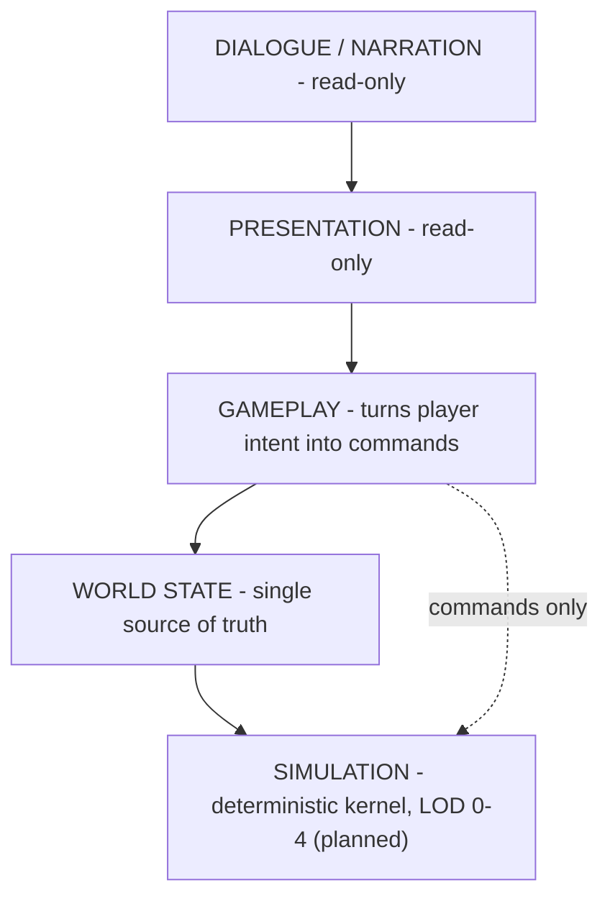

# VAELEN

**NOTHING IS GIVEN. EVERYTHING IS INHERITED.**
*HISTORY BELONGS TO NO ONE.*

Category: Living World RPG. World: **AELVOR**. Engine: Unreal Engine 5.6 (C++20) around an
engine-agnostic simulation kernel that also builds headless with CMake.

> VAELEN never only shows what the world is. It shows what it has become.

## Promise

AELVOR is designed to be simulated as a whole - terrain, populations, families, economies,
polities, wars, infrastructure - and to keep its own history, so that every situation the player
meets is the outcome of earlier events rather than a placed set piece. The player starts as an
enslaved person in a huge autonomous mining colony, with no special destiny: what they inherit is
the colony's situation, and what they leave behind is inherited by others. This describes the
design goal (planned); the repository currently contains the Phase 00 foundation only (see
[Status](#status)).

## Philosophy

1. No chosen one: the player is one person among many; no script is written around them.
2. No main quest and no canonical ending: goals come from the state of the world.
3. Systems cause events: nothing important is triggered by a hand-placed scripted event.
4. Planned example: a gallery collapses in the mine -> ore output drops -> quotas rise, rations
   fall -> deaths and escapes increase -> a guild loses its ore contract -> prices rise in the port
   -> a polity reroutes its trade -> a generation later the collapse is a song, a law and a ruin.
5. The simulation is the single source of truth: rendering, dialogue and any LLM narration only
   read world state; none of them may modify it.
6. Determinism: same seed + same inputs = same result, through controlled random streams and
   persistent ids, event logs, replay and checkpoints (Phase 01, VALIDATED headless).

## Architecture



- Dependencies point downward only; data flows upward; upper layers influence the world only by
  submitting commands to the simulation.
- Kernel modules (`Source/VaelenCore` today) are pure C++20: no Unreal headers, no exceptions,
  no RTTI, no `rand()` / `<random>` / `<chrono>`, fixed-width integers. Enforced by
  `Tools/check_kernel_purity.py` (CTest entry `Kernel.Purity`) and by `-Werror` builds.
- The same kernel sources are compiled by Unreal Build Tool inside the UE 5.6 project and
  headless by CMake for unit, determinism and stress tests and for CI.
- Today `VaelenCore` provides fixed-width types, versions, assertions, logging, hashing,
  deterministic random streams and persistent ids; `Vaelen` is the Unreal bridge (log sink and
  assertion handler). Nothing above the foundation exists yet.
- Reference: [Docs/ARCHITECTURE.md](Docs/ARCHITECTURE.md).

## Repository layout

```
Vaelen.uproject                  UE 5.6 project: modules VaelenCore (PreDefault), Vaelen (Default)
CMakeLists.txt                   headless kernel build (root): options, warning flags, defines
CMakePresets.json                configure / build / test presets
.github/workflows/kernel-ci.yml  headless CI: Linux clang/gcc (with and without asserts), clang-format, Windows MSVC, macOS
Config/                          DefaultEngine/Game/Editor/Input.ini
Docs/                            ARCHITECTURE.md, CONVENTIONS.md, DECISIONS.md, ROADMAP.md, STATUS.md
Source/
  Vaelen.Target.cs, VaelenEditor.Target.cs
  VaelenCore/                    KERNEL: Public/Vaelen/Core/*.h, Private/*.cpp, CMakeLists.txt, VaelenCore.Build.cs
  VaelenSim/                     KERNEL (Phase 01): entities, components, systems; Public/Vaelen/Sim/*.h
  VaelenPopulation/              KERNEL (Phase 04): persons, families, demographics; Public/Vaelen/Population/*.h
  VaelenSociety/                 KERNEL (Phase 05): organisations, standing, norms, bondage; Public/Vaelen/Society/*.h
  VaelenEconomy/                 KERNEL (Phase 06): goods, stocks, production, markets, trade, wealth; Public/Vaelen/Economy/*.h
  VaelenPolitics/                KERNEL (Phase 07): polities, law, authority, succession; Public/Vaelen/Politics/*.h
  VaelenMilitary/                KERNEL (Phase 08): levies, armies, marching, battle, siege; Public/Vaelen/Military/*.h
  Vaelen/                        Unreal primary game module (bridge to the kernel, UBT only)
Tests/
  Harness/                       VaelenTest.h (macros, registry, ScopedAssertCapture), TestMain.cpp (runner)
  Core/                          Test_<Suite>.cpp -> CTest entry Core.<Suite>
  Sim/                           Test_<Suite>.cpp -> CTest entry Sim.<Suite>
Tools/                           check_kernel_purity.py, kernel_modules.txt
```

## Build and test the kernel headless

Requirements: CMake >= 3.24, a C++20 compiler, Ninja (Linux and macOS presets), Python 3 for the
`Kernel.Purity` test. No Unreal installation is needed.

```
cmake --preset linux-clang-debug
cmake --build --preset linux-clang-debug
ctest --preset linux-clang-debug
```

Presets in `CMakePresets.json` (each builds into `out/build/<preset>`):

| Configure preset | Build / test preset | Host | Compiler, configuration |
|---|---|---|---|
| `linux-clang-debug` | same name | Linux | clang++, Debug |
| `linux-clang-release` | same name | Linux | clang++, RelWithDebInfo |
| `linux-gcc-debug` | same name | Linux | g++, Debug |
| `linux-gcc-release` | same name | Linux | g++, RelWithDebInfo |
| `linux-clang-noasserts` | same name | Linux | clang++, RelWithDebInfo, `VAELEN_ENABLE_ASSERTS=OFF` |
| `linux-gcc-noasserts` | same name | Linux | g++, RelWithDebInfo, `VAELEN_ENABLE_ASSERTS=OFF` |
| `macos-debug` | same name | macOS | default compiler, Debug |
| `windows-msvc` | `windows-msvc-debug`, `windows-msvc-release` | Windows | Visual Studio 17 2022, x64 |

Without presets, in any build directory:

```
cmake -S . -B out/build/my-clang -G Ninja -DCMAKE_BUILD_TYPE=Debug -DCMAKE_CXX_COMPILER=clang++
cmake --build out/build/my-clang
ctest --test-dir out/build/my-clang --output-on-failure
out/build/my-clang/Tests/Core/VaelenCoreTests [--suite Random] [--filter Text] [--list] [--verbose] [--shuffle 1]
python3 Tools/check_kernel_purity.py --root . [--verbose]        # --self-test exercises every rule
```

CTest entries (14): `Kernel.Purity`, `Kernel.PuritySelfTest`, one `Core.<Suite>` per
`Tests/Core/Test_<Suite>.cpp` (Assert, CoreTypes, Harness, Hash, Ids, Log, LogFloor, Random,
Version) and `Core.Registry`, `Core.Shuffled`, `Core.Reversed`. CMake options:
`VAELEN_BUILD_TESTS` (ON), `VAELEN_WARNINGS_AS_ERRORS` (ON), `VAELEN_ENABLE_ASSERTS` (ON),
`VAELEN_REQUIRE_PURITY_CHECK` (ON).

## Open the Unreal project

1. Install Unreal Engine 5.6 and Visual Studio (2022 or 2026) with the "Game development
   with C++" workload (including the Unreal Engine components it offers).
2. Right-click `Vaelen.uproject` and choose "Generate Visual Studio project files"
   (`Vaelen.sln` is git-ignored and always regenerated).
3. Open the solution, build the `VaelenEditor` target in Development Editor, then launch the
   editor from `Vaelen.uproject`. On start the `Vaelen` module logs
   `VAELEN <version> - kernel save format v<n> - kernel asserts on - module started`.

This path was walked for the first time on 2026-09-07, on UE 5.6.1 with MSVC 14.51 from
Visual Studio 2026 (UBT calls that toolchain "not a preferred version" and uses it anyway).
`VaelenEditor Win64 Development` builds from scratch with no errors, the six modules load,
and the editor prints:

```
LogVaelen: VAELEN 0.0.1 - kernel save format v3 - kernel asserts on - module started
```

Still not exercised: the `Vaelen` game target (monolithic), any configuration other than
Development, and engine-backed CI — that build was run by hand, once.
`Docs/ARCHITECTURE.md` section 8 records what it took and what it left.

## Status

| Component | Where | STATUS |
|---|---|---|
| Kernel primitives: CoreTypes, Version, Assert, Log, Hash, Random, Ids | `Source/VaelenCore` | VALIDATED (Phase 00) headless with clang 18 and gcc 13; VALIDATED under UBT (UE 5.6, 2026-09-07) |
| Kernel module registration | `Source/VaelenCore/Private/VaelenCoreModule.cpp` | VALIDATED (UE 5.6, 2026-09-07) |
| Unreal bridge module `Vaelen` | `Source/Vaelen` | VALIDATED (UE 5.6, 2026-09-07) |
| Simulation module (01.01 entities, 01.02 components, 01.03 systems and scheduler, 01.04 clock and calendar, 01.05 events, 01.06 world and snapshot, 01.07 deterministic replay gate, 01.08 long-duration mini-world gate, 02.01 tile grid and world map, 02.02 fixed point and noise, 02.03 elevation and coastline, 02.04 climate and biomes, 02.05 hydrology, 02.06 regions, 02.07 deposits, 02.08 pipeline gate; Phase 02 closed headless; 03.01 eras and chronicle, 03.02 cultures and coarse population, 03.03 languages and naming, 03.04 religions, 03.05 disasters and omens, 03.06 pre-history run, 03.07 queryable history, 03.08 gate; Phase 03 closed headless) | `Source/VaelenSim` | VALIDATED (Phase 01) headless; VALIDATED under UBT (UE 5.6, 2026-09-07) |
| Population module (04.01 persons and the two grains of population, 04.02 ageing, mortality, fertility and the reconciliation of the grains, 04.03 families and lineage, 04.04 needs and body, 04.05 traits, skills and names, 04.06 LOD bridge, 04.07 persons in history, 04.08 gate) | `Source/VaelenPopulation` | VALIDATED (04.01-04.08, Phase 04 closed) headless; VALIDATED under UBT (UE 5.6, 2026-09-07) |
| Society module (05.01 organisations: councils and temples, seats, heads, coarse counts; 05.02 standing: ranks, tiers, the elite; 05.03 norms per culture, marriages by culture; 05.04 bondage and slavery; 05.05 organisations acting; 05.06 the social shape across the grains; 05.07 society in history; 05.08 gate) | `Source/VaelenSociety` | VALIDATED (05.01-05.08, Phase 05 closed) headless; VALIDATED under UBT (UE 5.6, 2026-09-07) |
| Economy module (06.01 goods and stocks: kinds, common and house stocks, the endowment, split and fold across the grains; 06.02 production and consumption: the harvest, the meals, the ration the needs observe, deposits and craft; 06.03 markets and prices: a market per region, prices from wanted over held, price events; 06.04 trade and routes: routes on price gaps, goods carried cheap to dear, settlements; 06.05 wealth and inheritance: houses valued and ranked, standing lifted, heirs by descent; 06.06 the economy across the grains: conservation to the unit over 500 years; 06.07 the economy in the chronicle; 06.08 gate) | `Source/VaelenEconomy` | VALIDATED (06.01-06.08, Phase 06 closed) headless; VALIDATED under UBT (UE 5.6, 2026-09-07) |
| Politics module (07.01 polities: entities founded on councils, the seat and the ruler, belonging written on the region itself; 07.02 law: one number on the polity, proclaimed onto the regions as dues the economy observes, collected in grain into a treasury, the share moving with what it holds; 07.03 authority and reach: the hold of a region falling with its distance from the seat, the grain a word costs to carry, ground taken and ground that slips; 07.04 succession: the line of rulers, the claimant the descent custom names, and the unrest of a seat taken by anyone else; 07.05 factions: a grievance with a place and sometimes a person, taking the ground when nobody answers it; 07.06 diplomacy: relations warmed and cooled by the world two polities share, and a war that puts the weaker border in play; 07.07 politics in the chronicle: a sentence for every political event, a record for what a century would remember; 07.08 the phase gate) | `Source/VaelenPolitics` | VALIDATED (07.01-07.08, Phase 07 closed) headless; UNVERIFIED under UBT |
| Military module (08.01 levies and armies: people taken out of the regions a polity holds, fed out of its treasury, melting away when they are not; 08.02 marching: a host walks the region graph towards the nearest enemy host, one hop a season, eats off what it stands on and loosens an enemy ruler's grip; 08.03 battle: two hosts on one region settled in a year by strength, whose ground it is and a stream fixed by the world seed, the loser falling back or gone; 08.04 siege: a host sitting before an enemy seat brings its wall down at the rate of the men before it, and a polity that loses its seat ends) | `Source/VaelenMilitary` | VALIDATED (08.01-08.04) headless; UNVERIFIED under UBT |
| Presentation: the simulated world laid out in the Unreal viewport (`AVaelenAtlasActor`, console command `Vaelen.Atlas`) | `Source/Vaelen` | VALIDATED under UBT (UE 5.6, 2026-09-08) |
| Test harness and runner | `Tests/Harness` | VALIDATED (Phase 00) |
| Core test suites (133 tests, 108 without assertions) | `Tests/Core` | VALIDATED |
| Kernel purity checker | `Tools/check_kernel_purity.py` | VALIDATED (Phase 00) |
| Headless CI workflow | `.github/workflows/kernel-ci.yml` | All 9 jobs green on GitHub: six Linux legs, clang-format, Windows MSVC, macOS AppleClang |
| Modules of Phases 01-20 | - | PLANNED (do not exist) |

Numbers, commands and the current BUILD STATUS block: [Docs/STATUS.md](Docs/STATUS.md).

## Documentation

- [Docs/ARCHITECTURE.md](Docs/ARCHITECTURE.md) - layers, dual build, module map, planned modules
  per phase, test infrastructure, known discrepancies.
- [Docs/CONVENTIONS.md](Docs/CONVENTIONS.md) - language, formatting, naming, purity rules,
  determinism rules, logging, assertions, STATUS labels, tests, process.
- [Docs/DECISIONS.md](Docs/DECISIONS.md) - architecture decision records ADR-0001 to ADR-0008
  (dual build, no exceptions/RTTI, random streams, persistent ids, logging, test harness,
  integer ranges, purity check), append-only.
- [Docs/STATUS.md](Docs/STATUS.md) - living build status: BUILD STATUS block, per-file STATUS
  table, what has been verified and what has not.

## Development protocol

- Work protocol for every task: PLAN -> EXPLAIN -> IMPLEMENT -> TEST -> VALIDATE -> NEXT.
  Never jump to a large implementation; each progress report shows the BUILD STATUS block
  (format in `Docs/CONVENTIONS.md`, section 14.2), the files touched, the tests run, the
  problems found and the next task.
- Status labels: `VALIDATED`, `PROTOTYPE`, `INCOMPLETE`; `UNVERIFIED` for engine-only files the
  headless pipeline cannot compile. No fake "done": a `VALIDATED` file contains no TODO or FIXME
  (purity rule R6) and no test is reported that was not run.
- Every important system needs unit, integration, deterministic, edge-case and long-duration
  tests before it is `VALIDATED`; everything compiles warning-free with both `clang++` and `g++`.
- Layering and determinism rules above are not negotiable; a new kernel module is added to
  `Tools/kernel_modules.txt`, `CMakeLists.txt`, `Vaelen.uproject` and the targets.
- Phases: 00 FOUNDATION (current), 01 CORE SIMULATION, 02 WORLD, 03 HISTORY, 04 POPULATION,
  05 SOCIETY, 06 ECONOMY, 07 POLITICS, 08 MILITARY, 09 INFRASTRUCTURE, 10 PLAYER,
  11 MINING COLONY, 12 GAMEPLAY, 13 PRESENTATION, 14 UI, 15 STREAMING & LOD,
  16 SAVE/PERSISTENCE, 17 DEBUG TOOLS, 18 STRESS TEST, 19 MODDING, 20 POLISH.
  Everything after Phase 00 is planned.

Documentation and code are written in English.
